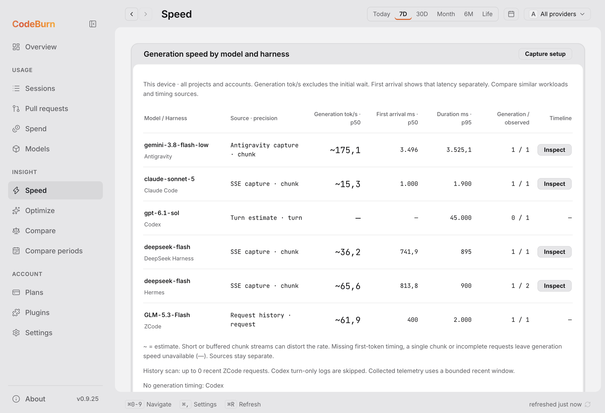
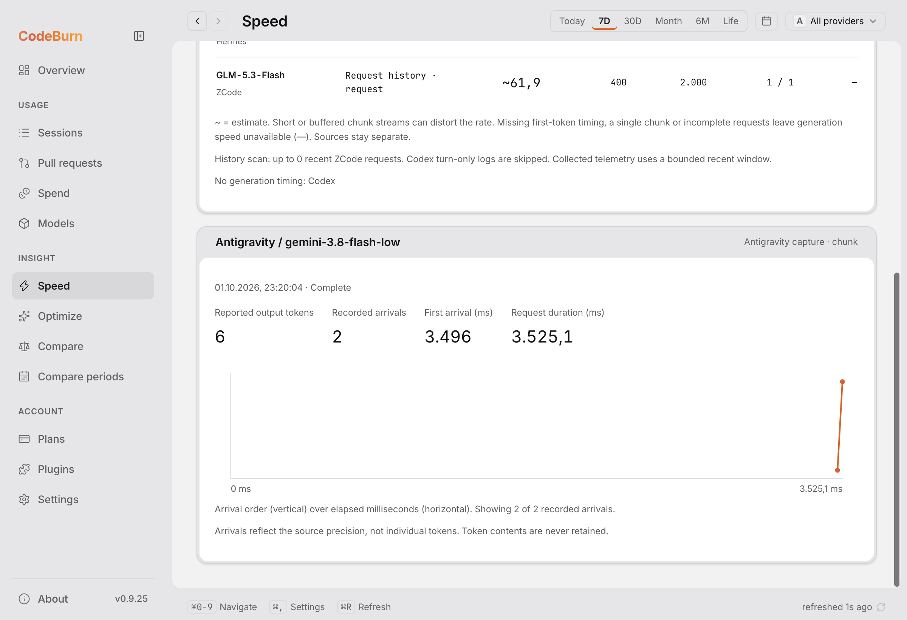
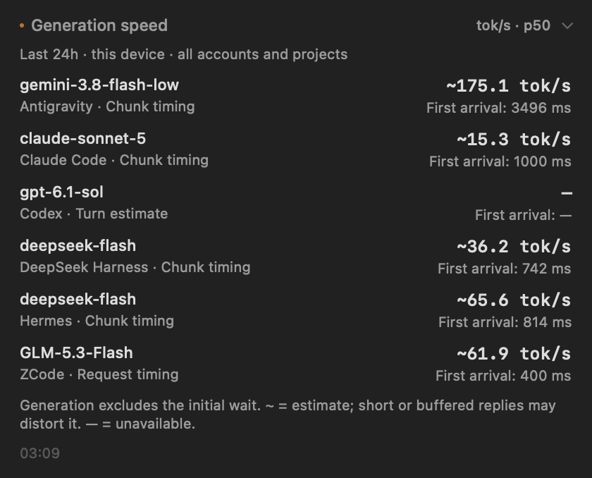
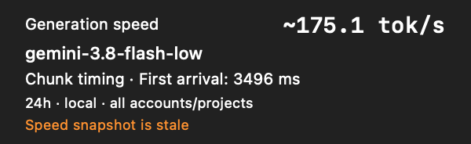

# Speed UI validation

These screenshots demonstrate the new desktop Speed view and the native macOS
summary components. They use a bounded fixture, **not a comparative benchmark**.
The Antigravity record reproduces the timing/counter metadata of the earlier
real CLI capture: six reported tokens, two arrivals at 3,496.041083 and
3,524.59425 ms, and completion at 3,525.051708 ms. Other fixture rows are synthetic.
No prompts, responses, credentials or real project/account data are included.

The desktop screenshots come from a real Electron process using production
preload/IPC and the current built CLI. Non-speed overview data was stubbed and
history scans disabled. Assertions checked each model/harness rate against CLI
JSON, unavailable Codex generation timing, six tokens versus two chunk arrivals,
DeepSeek Harness filtering, timeline clearing and an empty date window.

The native screenshots render the production `SpeedSection` and `SpeedGlance`
SwiftUI components against the same CLI fixture in an isolated store. They do
not represent installation over the user's menubar app. The Dock block was
checked at 0.9, 1 and 1.25 scale, including its fixed height and stale state.

The large Antigravity estimate comes from two closely spaced chunks, which can
be buffered. It is explicitly marked `~`; neither its 1.7 tok/s end-to-end average
nor its chunk estimate establishes precise model decode speed. Native token
timelines use observed individual-token timestamps. Without enough timing data,
the displayed generation speed stays unavailable.
